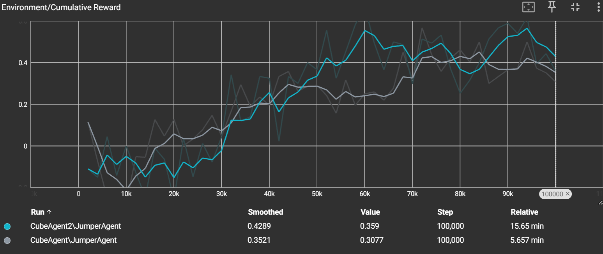

# Opdacht: Jumper
## Namen:
Joshua Hall: s1399133 

Jarn Vaerewijck: s144013

## Documentatie:
...
De bedoeling van dit project is om een stilstaande agent te laten springen over een bewegend obstakel.  
Voor dit project moest er ook een extra functionaliteit gekozen worden, wij hebben gekozen om de agent obstakels van 2 kanten te laten ontwijken.  
Hiervoor hebben we eerste een prefab gemaakt bestaand uit een plane, de agent en 2 obstakels.  
  
Alle bewegingen worden gestuurd vanuit de JumperAgent script op de agent, deze reset de locatie van de obstakels en geeft ze een random snelheid aan het begin van elke episode.  
De obstakels bewegen dan naar de agent toe over de x- en z-as, als deze de agent aan raken krijgt die een negatieve score, als ze de agent niet aan raken en ze te ver gaan krijgt de agent een positieve score.  
De agent weet op elk moment zijn eigen positie en de postie van de obstakels, om de obstakels te ontwijken heeft de agent alleen de mogelijkheid om te springen.  
  
### Trainen:
...
Bij het trainen is de minimale reward -1 en de maximale reward 1.  
Als we de training starten zijn de eerste waarden vrijwel altijd rond de nul, wat zich vertaalt in een accuracy van ± 50%.  
Dit is te verwachten van een agent die willekeurige acties neemt.  
Als je naar de grafiek kijkt kan je zien dat de reward voor de eerste 30.000 stappen niet verbeterd, het is pas dan dat de gemiddelde reward begint te stijgen.  
  
  
Na 100.000 stappen bereikt de training een mean reward van ± 4, wat een accuracy van 80% geeft.